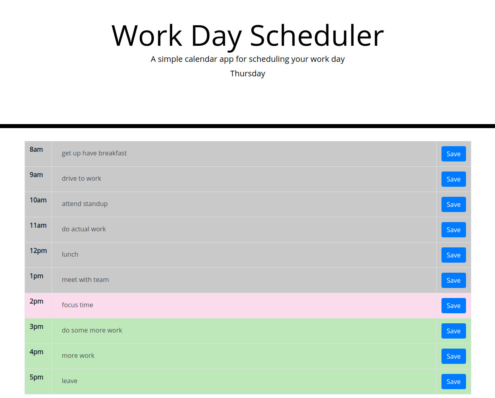

# Homework week 5 | Work Day Scheduler

This week I made a work day scheduler. The user can enter tasks, meetings, to-do's, etc. in the hourly time slots, hit the save button and the information entered will persist after the web page is reloaded.

## Features 

* The current date is displayed in the header of the web page
* The user can enter input to each timeslot and that information will persist even after the web page is reloaded

## Screenshot

## Link to web app

Link to my [Work Day Scheduler](https://murda02.github.io/homework-week-5-work-day-scheduler-dlm/)

## Author

    Dave Murphy